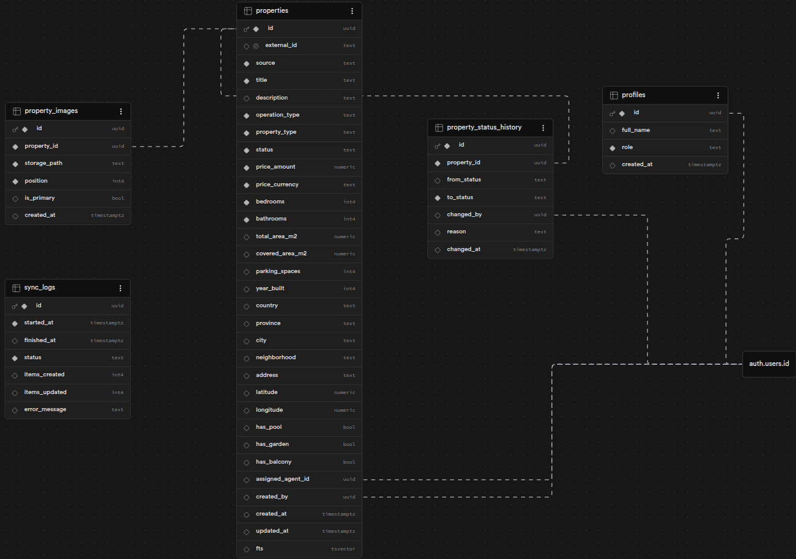

# Gestión de Inmuebles

Sistema de administración de propiedades inmobiliarias con soporte para múltiples roles, sincronización con fuente externa y exportación de datos.

## Stack

- **Next.js 14** — App Router, Server Components por defecto
- **Supabase** — Base de datos, autenticación, storage y políticas de seguridad
- **TypeScript strict** — Sin `any` sin justificación
- **TailwindCSS** — Estilos
- **React Hook Form + Zod** — Formularios y validación
- **TanStack Query** — Fetching y caché en componentes cliente
- **Vitest + Testing Library** — Tests unitarios e integración

## Setup

### 1. Variables de entorno

```bash
cp .env.example .env.local
```

Completar con los valores del proyecto en Supabase → Project Settings → API:

```
NEXT_PUBLIC_SUPABASE_URL=
NEXT_PUBLIC_SUPABASE_ANON_KEY=
SUPABASE_SERVICE_ROLE_KEY=
EXTERNAL_API_URL=http://localhost:3000/api/mock/rentals
```

### 2. Instalar dependencias

```bash
npm install
```

### 3. Aplicar migraciones

Ejecutar en orden en Supabase → SQL Editor:

1. `supabase/migrations/20260417000001_full_text_search_and_indexes.sql`
2. `supabase/migrations/20260418000001_auth_user_profile_trigger.sql`
3. `supabase/migrations/20260418000002_rls_policies.sql`

### 4. Iniciar en desarrollo

```bash
npm run dev
```

### 5. Correr tests

```bash
npm test
```

## Usuarios de prueba

| Rol | Email | Contraseña |
|-----|-------|------------|
| Admin | admin@test.com | password123 |
| Agent | agent@test.com | password123 |
| Viewer | viewer@test.com | password123 |

> Los roles se asignan manualmente en Supabase → Table Editor → `profiles`.

## Diagrama ER



## Decisiones de diseño

### Separación en capas (Clean Architecture)

El código se organiza en capas con responsabilidades claras:

```
UI (páginas y componentes)
  └─ hooks / services      ← lógica de negocio
       └─ repositories     ← acceso a base de datos
            └─ adapters    ← integración con API externa
```

Cada capa solo conoce a la siguiente. Si cambia Supabase o la API externa, el impacto queda contenido en su capa.

### Seguridad a nivel de base de datos (RLS)

Todas las tablas tienen políticas RLS activas en Supabase. Esto significa que aunque alguien acceda directo a la base de datos con la clave pública, las reglas de acceso por rol siguen aplicando:

- **Viewer** — solo ve propiedades con estado público
- **Agent** — ve todo, edita solo las propiedades que tiene asignadas
- **Admin** — acceso completo

La validación en la API es una segunda línea de defensa, no la única.

### Adapter para la API externa

La API externa devuelve datos en su propio formato (`beds`, `baths`, `total_area`). En lugar de usar esos nombres directamente, un mapper los traduce al formato interno (`bedrooms`, `bathrooms`, `totalAreaM2`) antes de tocar la base de datos.

Si la API externa cambia su estructura, solo se modifica `lib/external-api/mappers.ts` — ni la base de datos ni la UI se ven afectadas.

### Validación de transiciones de estado

Las propiedades siguen un ciclo de vida definido:

```
draft → available → reserved → sold
                             → rented
                             → cancelled
```

Las transiciones inválidas (por ejemplo `sold → available`) se rechazan en el backend con un error claro. La UI solo muestra las opciones válidas para cada estado, pero la restricción real vive en el servidor.

## Próximas Mejoras e Iteraciones

Aunque el sistema es plenamente funcional y seguro, se han identificado las siguientes áreas de mejora para elevar la experiencia de usuario y la precisión del negocio:

### 1. Filtrado por Par Divisa-Monto
**Estado Actual:** El filtrado de precios es puramente numérico, lo que genera colisiones de resultados entre propiedades publicadas en Pesos Argentinos (ARS) y Dólares (USD).
- **Propuesta:** Acoplar los parámetros `minPrice` y `maxPrice` a un selector de divisa (`currency`) en la interfaz.
- **Impacto:** Garantiza que los resultados sean homogéneos y evita que el usuario compare valores nominales que representan poderes adquisitivos totalmente distintos.

### 2. Optimización de Feedback en la Autorización
**Estado Actual:** El sistema implementa seguridad en capas (RLS y Repositories) que bloquea acciones no autorizadas de forma "silenciosa".
- **Captura de Errores 403:** Mapear excepciones de autorización para disparar notificaciones (Toasts) informativas como: *"No posees permisos para modificar esta propiedad"*.
- **UI Preventiva:** Implementar lógica en el frontend para ocultar o deshabilitar elementos de edición si el `assigned_agent_id` no coincide con el usuario logueado.
- **Impacto:** Mejora la experiencia de usuario al transformar un bloqueo de seguridad en una respuesta clara del sistema, alineando la interfaz con las políticas del servidor.

### Roadmap de Funcionalidades Opcionales

Como objetivos de corto plazo, se han proyectado las siguientes implementaciones sugeridas:

- **Modo Oscuro:** Implementación mediante `next-themes` y la variante `dark:` de Tailwind CSS para soporte nativo de preferencias del sistema.
- **Ficha de Propiedad en PDF:** Generación dinámica de reportes descargables utilizando `react-pdf` para facilitar la exportación de detalles técnicos.
- **Internacionalización (i18n):** Adopción de `next-intl` para el manejo de rutas por localía y soporte multi-idioma (ES/EN) escalable.